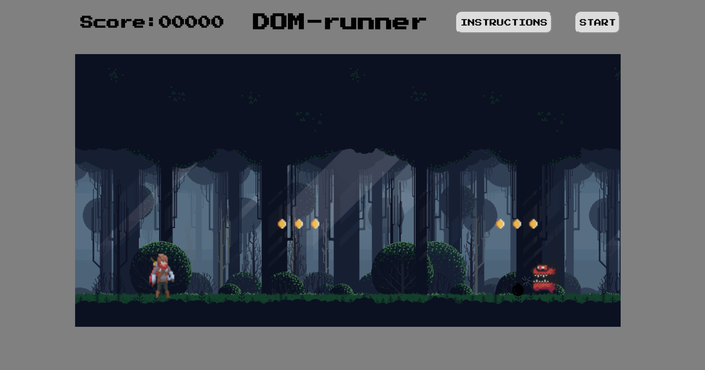
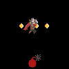
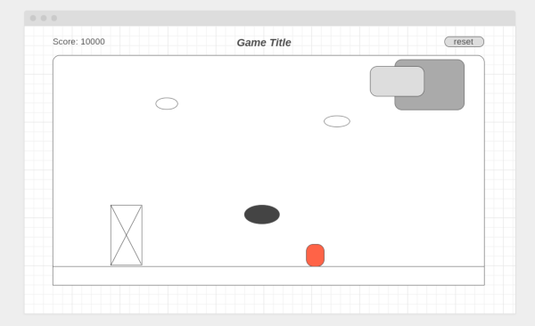

# DOM-runner

## How To Play

Ths Object of the game is to reach the end ALIVE!!!  
Jump, dodge, and annihilate any monster in your path!  
Bonus points for killing monsters and collecting coins.   

### Pressing Spacebar will tell DOM to attack!

### Pressing UpArrow will tell DOM to jump!

## Deployed Link 
 
[Play my Game](https://jground-33.github.io/Adventure-Game/)

## Psuedocode 

create a game viewport.  
* create a HTML header to diplay score, reset button and game Title.  
* establish game viewport centered in the browser window with flexbox,  
* :Optional: have body background render scales gaussian blur version of the game.  
  
create the background.  
* have a background img object with a constant x scroll speed property.  
* :Optional: have parallax background with z offsets.  
  
create a character object.  
* character has x and y positions with jump(), attack(), and death collision detection() methods.  
* attack method will be either a melee or blaster option.  
  
create enemies class.  
* create enemies with x,y postitions with delete(), move() and maybe attack colision detection() methods.  
* delete enimies if attack sucessful or if ememy leaves viewport.  
  
create obstacles class.  
* obstacle objects will have x,y positions and x speed properties with delete() and move() methods.  
* delete obstacles if obstacle leaves viewport.  
  
create coins class.  
* coin objects will have x,y positions, and collision detection methods to collide with character.  
  
add a laser beam class  
* laser beam object will have x,y positions and constant x speed properties with delete() and move() methods.  
  
:Optional: create air enemies class for later levels.  
* air enemies objects will have x,y properties and fire() methods.  

## User Stories 

* AAU I want to control the character's ability to jump by pressing the UpArrow. 

* AAU I want to have clear instructions on how to play.  

* AAU I want to be able to click a button to start a new game.

* AAU I want to be able to control the character to attack enemies with a button press. 

* AAU I want to have clear feedback about my score and if the game is over.

## Wireframe 

## Future goals 

* optimization on game loop nad collision detection.

* render background image with a parallax scroll. 

* additional levels with more eniemies and obstacles.

* changes controls to move the character in both directions.

* add more moves like slide and block. 

* ...

## Technologies Used: 

HTML, CSS, Vanilla JavaScript.

## Credits

Main Character Images - https://rvros.itch.io/animated-pixel-hero

Monsters and Coin Images - https://0x72.itch.io/dungeontileset-ii

Background Image - https://edermunizz.itch.io/free-pixel-art-forest
